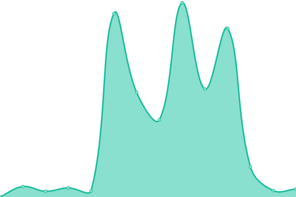
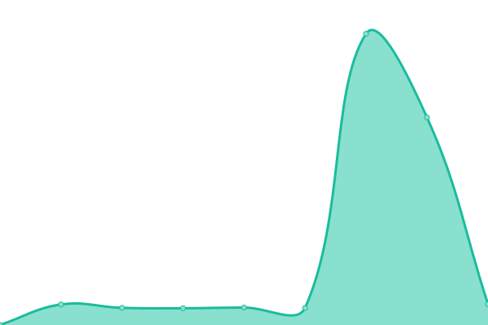
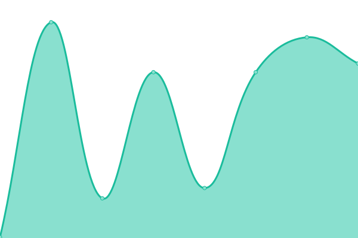

# [📈 Live Status](https://jeircul.github.io/upptime/): <!--live status--> **🟧 Partial outage**

This repository contains the open-source uptime monitor and status page for [Ove Aursland](https://jeircul.github.io/upptime/), powered by [Upptime](https://github.com/upptime/upptime).

With [Upptime](https://upptime.js.org), you can get your own unlimited and free uptime monitor and status page, powered entirely by a GitHub repository. We use [Issues](https://github.com/jeircul/upptime/issues) as incident reports, [Actions](https://github.com/jeircul/upptime/actions) as uptime monitors, and [Pages](https://jeircul.github.io/upptime/) for the status page.

<!--start: status pages-->
<!-- This summary is generated by Upptime (https://github.com/upptime/upptime) -->
<!-- Do not edit this manually, your changes will be overwritten -->
<!-- prettier-ignore -->
| URL | Status | History | Response Time | Uptime |
| --- | ------ | ------- | ------------- | ------ |
|  [joracul](https://www.joracul.duckdns.org/) | 🟩 Up | [joracul.yml](https://github.com/jeircul/upptime/commits/HEAD/history/joracul.yml) | 

 1673ms
     
 | 

<a href="https://jeircul.github.io/upptime/history/joracul">100.00%</a>
    

|  [Nextcloud](https://nextcloud.joracul.duckdns.org) | 🟩 Up | [nextcloud.yml](https://github.com/jeircul/upptime/commits/HEAD/history/nextcloud.yml) | 

 819ms
     
 | 

<a href="https://jeircul.github.io/upptime/history/nextcloud">100.00%</a>
    

|  [PhotoPrism](https://photoprism.joracul.duckdns.org) | 🟥 Down | [photo-prism.yml](https://github.com/jeircul/upptime/commits/HEAD/history/photo-prism.yml) | 

 491ms
     
 | 

<a href="https://jeircul.github.io/upptime/history/photo-prism">100.00%</a>
    

|  [Upptime](https://jeircul.github.io/upptime) | 🟩 Up | [upptime.yml](https://github.com/jeircul/upptime/commits/HEAD/history/upptime.yml) | 

 51ms
     
 | 

<a href="https://jeircul.github.io/upptime/history/upptime">100.00%</a>
    

|  [Ethplorer API](https://api.ethplorer.io/getLastBlock?apiKey=freekey) | 🟩 Up | [ethplorer-api.yml](https://github.com/jeircul/upptime/commits/HEAD/history/ethplorer-api.yml) | 

 536ms
     
 | 

<a href="https://jeircul.github.io/upptime/history/ethplorer-api">100.00%</a>
    

|  [Binplorer API](https://binplorer.com/images/0775fc6cdb5dbf3d709e494899708dab.png) | 🟩 Up | [binplorer-api.yml](https://github.com/jeircul/upptime/commits/HEAD/history/binplorer-api.yml) | 

 371ms
     
 | 

<a href="https://jeircul.github.io/upptime/history/binplorer-api">100.00%</a>
    

|  [CoinGecko API](https://api.coingecko.com/api/v3/ping) | 🟩 Up | [coin-gecko-api.yml](https://github.com/jeircul/upptime/commits/HEAD/history/coin-gecko-api.yml) | 

 153ms
     
 | 

<a href="https://jeircul.github.io/upptime/history/coin-gecko-api">100.00%</a>
    

|  [Firi API](https://api.firi.com/time) | 🟩 Up | [firi-api.yml](https://github.com/jeircul/upptime/commits/HEAD/history/firi-api.yml) | 

 528ms
     
 | 

<a href="https://jeircul.github.io/upptime/history/firi-api">100.00%</a>
    

|  [Solscan API](https://public-api.solscan.io/block/last?limit=10) | 🟥 Down | [solscan-api.yml](https://github.com/jeircul/upptime/commits/HEAD/history/solscan-api.yml) | 

 203ms
     
 | 

<a href="https://jeircul.github.io/upptime/history/solscan-api">0.00%</a>
    

<!--end: status pages-->

[**Visit our status website →**](https://jeircul.github.io/upptime/)

## 📄 License

- Powered by: [Upptime](https://github.com/upptime/upptime)
- Code: [MIT](./LICENSE) © [Ove Aursland](https://demo.upptime.js.org)
- Data in the `./history` directory: [Open Database License](https://opendatacommons.org/licenses/odbl/1-0/)
